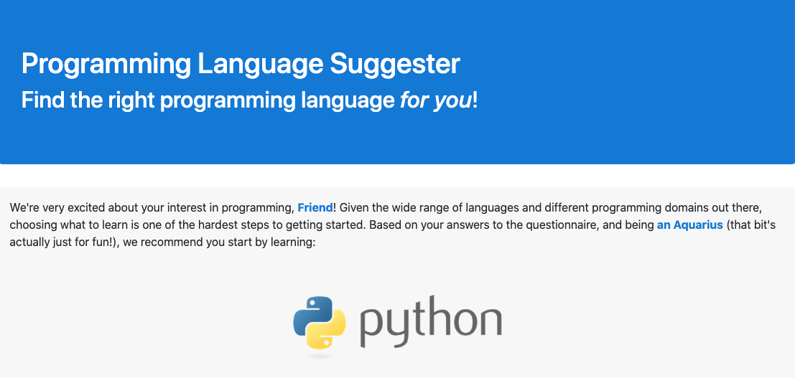

# Programming Language Suggester

### Suggests the right programming language for you.

### _By Micah Olson_

## Technologies Used
* HTML5
* CSS (extended by Bootstrap 4.5.3)
* JavaScript (extended by jQuery 3.5.1)

## Description
Fill out a brief questionnaire and receive a personalized suggestion for a programming language matching your personality.

## Setup and Installation
* This project's interactive web page can be viewed [here](https://micaholson.github.io/programming-language-suggester).  

* To download, then view or edit a local copy yourself, follow the instructions below:  

  * Clone the repository to a local directory using the command-line tool `git` ([how to install git](https://www.learnhowtoprogram.com/introduction-to-programming/getting-started-with-intro-to-programming/git-and-github)).  
    `$ cd ~/[directory]/[path]/[of]/[choice]/`  
    `$ git clone https://github.com/MicahOlson/programming-language-suggester.git`  
  
  * Navigate to the top level of the project directory.  
    `$ cd programming-language-suggester/`   

  * To view the site locally, open the file called `index.html` in your default browser.  
    `$ open index.html`  

    * Alternatively, you can navigate to the project directory through your system's GUI file manager, then double-click `index.html` to open it in your default browser.  

  * To edit the project, open the files in your preferred code editor. Here are some recommendations:
    * [Visual Studio Code](https://code.visualstudio.com) - "Code editing. Redefined."
    * [Atom](https://atom.io) - "A hackable text editor for the 21st Century"
    * [SublimeText](https://www.sublimetext.com) - "A sophisticated text editor for code, markup and prose"

## Known Bugs
* No known bugs.
* This project will be under regular development. If you  
find a bug, please let me know at the email address below. 

## License
[GPLv3](https://choosealicense.com/licenses/gpl-3.0/)\
Copyright &copy; 2021 Micah L. Olson

## Contact Information
Micah Olson micah.olson@protonmail.com